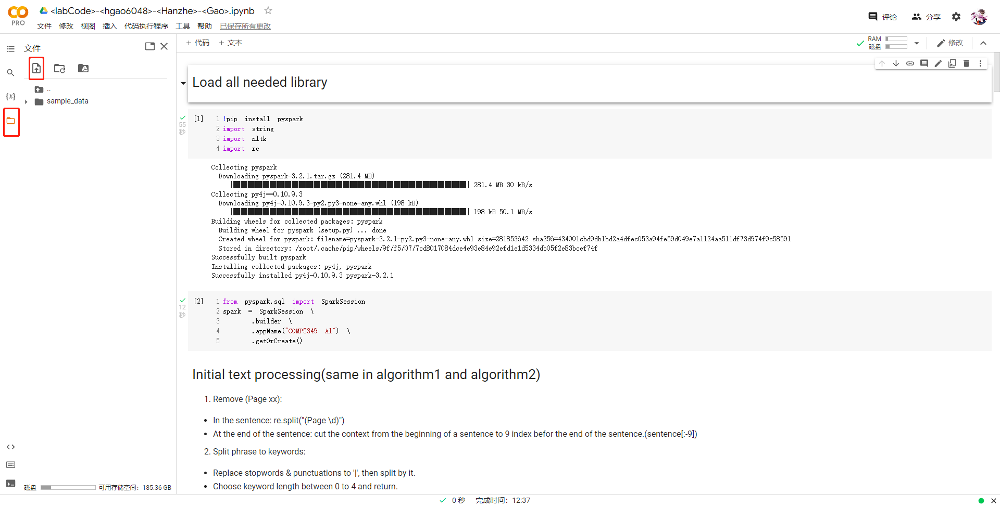
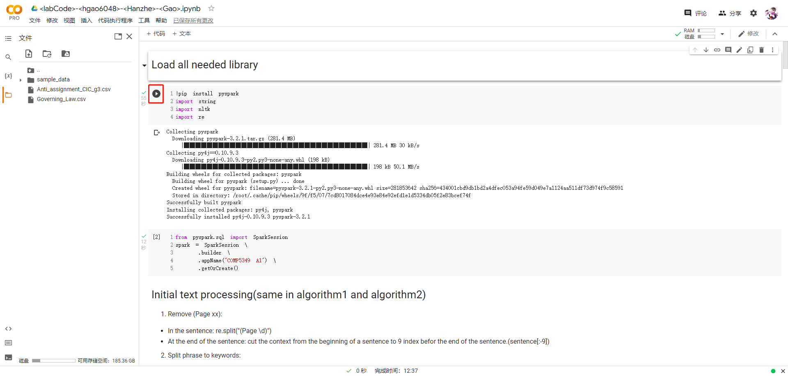

# How to run this jupyter file

Open the google drive (url = https://drive.google.com/drive/my-drive), sign in with your own google account.T hen clicking the "My Drive" button which is under the search bar and upload the .ipynb file. Right click the file you uploaded, find"open way" then choose "Google colaboratory" . Then the jupyter file is opened already.

## Upload .csv data files

For this assignment, there are two data files called "Governing_Law.csv" and "Anti_assignment_CIC_g3.csv". As the picture show below, click on the red box button and choose these two files. 
After uploading, the file will appear in the sidebar.

## Run each cell through "run cell" button(As the picture shows below)

